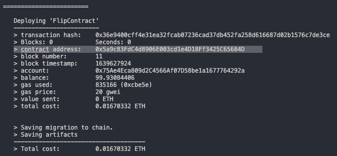

# Thegraph & Web3 - Payments Decentralization


> This project will be an intriduction to thegraph, solidity and web3 in general

## Why this project

### Cell Phones in Africa: Communication Lifeline vs land line

- https://www.pewresearch.org/global/2015/04/15/cell-phones-in-africa-communication-lifeline/
- https://www.cnn.com/2012/10/04/tech/mobile/africa-mobile-opinion/index.html

## ABI.json

- https://rinkeby.etherscan.io/address/0x869498c3Bb540BF94861EaB9A82122BFB1EF0fe7#code

- https://ethereum.stackexchange.com/questions/71060/sending-the-bool-to-function-payable-in-another-contract

## Step 1: Contract Compilation

- truffle init

- sudo truffle compile

- truffle migrate

# Will install the lastest compiler from the config

- Truffle Contract: 0xDCB3D4724200fA87542695197b36863C3c7df302

- Path: src/contracts/truffle_abis/FlipContract.json

## Step 2: Setup thegraph

### Ganache CLI

Install the IDE app OR below

- npm install -g ganache-cli

- ganache-cli -h 0.0.0.0

# Available Accounts

(0) 0x91f1fA42d81dA4b9b2f8a55fA4A29eb9Dc389080 (100 ETH)

# Private Keys

(0) 0xe916cb358cee39f660a86f5bc867972e3127b0e35e68fbb06a66f09295b7fde7

### Local thegraph

- https://github.com/graphprotocol/graph-node/blob/master/docker/docker-compose.yml

Read more: https://medium.com/blockrocket/dapp-development-with-a-local-subgraph-ganache-setup-566a4d4cbb

```
docker run -it \
  -e postgres_host=host.docker.internal \
  -e postgres_port=5432 \
  -e postgres_user=graph-node \
  -e postgres_pass=oh-hello \
  -e postgres_db=graph-node \
  -e ipfs=host.docker.internal:5001 \
  -e ethereum=mainnet:http://localhost:8545/ \
  graphprotocol/graph-node:latest

```

- docker-compose up

## The graph

- graph init --product hosted-service poboisvert/project_name

- ABI is in src/truffle_abis

- Contract ID
  

- sh run-graph-node.sh

## See if it works - Console

- truffle console

- const truffleTutorial = await TruffleTutorial.deployed()

- const address = await truffleTutorial.address

- address

> '0xA91C04AEe928bF04f7457970f99bd8925Ec46B6f'

- const FlipContract = await FlipContract.deployed()

- const address_flip = await FlipContract.address

- address_flip

- const message = await truffleTutorial.message()

- message

> 'Hello World!'

# Issues

- https://ethereum.stackexchange.com/questions/99409/failed-to-deploy-to-graph-node-ethereum-network-not-supported-by-registrar-mai
