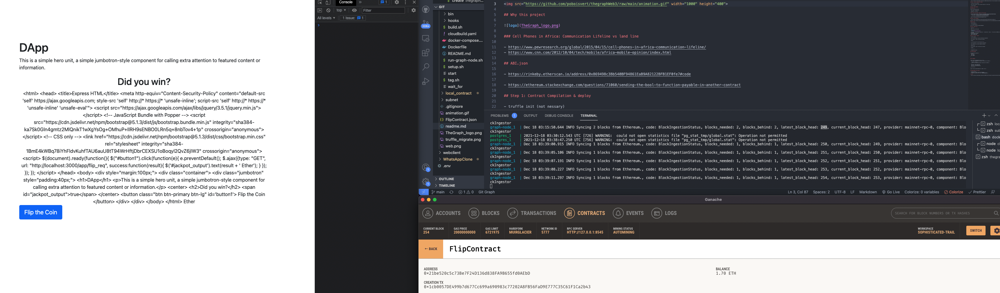
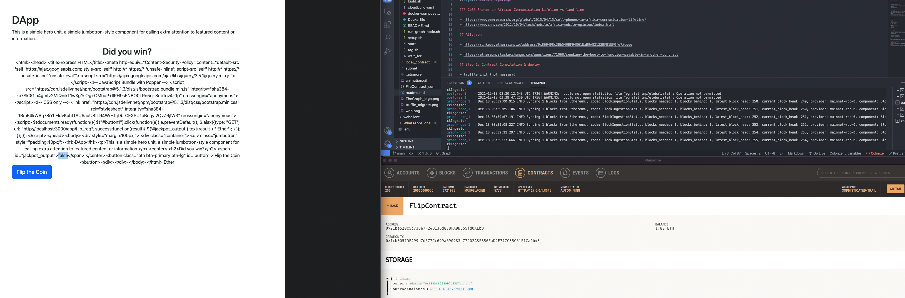
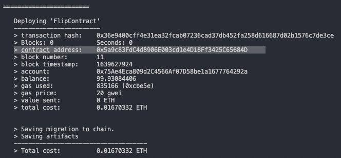

# Thegraph & Web3 - Payments Decentralization






## Why this project


### Cell Phones in Africa: Communication Lifeline vs land line

- https://www.pewresearch.org/global/2015/04/15/cell-phones-in-africa-communication-lifeline/
- https://www.cnn.com/2012/10/04/tech/mobile/africa-mobile-opinion/index.html

## ABI.json

- https://rinkeby.etherscan.io/address/0x869498c3Bb540BF94861EaB9A82122BFB1EF0fe7#code

- https://ethereum.stackexchange.com/questions/71060/sending-the-bool-to-function-payable-in-another-contract

## Step 1: Contract Compilation & deploy

- truffle init (not nessary)

- sudo truffle compile (install required compiler will need sudo)

- truffle migrate

## Step 2: Setup thegraph

### Ganache CLI

Install the IDE app OR below

- npm install -g ganache-cli

- ganache-cli -h 0.0.0.0

# Will install the lastest compiler from the config

- Truffle contract address: FlipContract: 0x21be520c5c73Be7F24D136d838FA9B655fd0AEbD
- Console address: 0x21be520c5c73Be7F24D136d838FA9B655fd0AEbD

  - Link Account: 0xF80D8E0939b7D6FE7a76632A830D6F4693BC684c

- Path: src/contracts/truffle_abis/FlipContract.json

### Step 3: Local thegraph

- https://github.com/graphprotocol/graph-node/blob/master/docker/docker-compose.yml

Read more: https://medium.com/blockrocket/dapp-development-with-a-local-subgraph-ganache-setup-566a4d4cbb

#### Run Docker

- docker-compose up

- sh run-graph-node.sh

You will see in Ganache eth_getBlockByNumber

## Step 4: Subnet local

- graph init

- ABI is in src/truffle_abis

- Contract ID
  

- graph init --contract-name FlipContract \ --index-events --studio \ --from-contract CONTRACT_ID
- cd subname
- Clean && npm run codegen
- npm run create-local
- npm run deploy-local

## See if it works - Console

- truffle console

- const truffleTutorial = await TruffleTutorial.deployed()

- const address = await truffleTutorial.address

- address

> '0xA91C04AEe928bF04f7457970f99bd8925Ec46B6f'

- const FlipContract = await FlipContract.deployed()

- const address_flip = await FlipContract.address

- address_flip

- const message = await truffleTutorial.message()

- message

> 'Hello World!'

- FlipContract.flip(0)

### Schema.graphql

```
type ExampleEntity @entity {
  id: ID!
  side: Int!
  win: Boolean!
  bet: BigInt!
}

```

### src/mapping

```
export function handlebet(event: bet): void {
  let entity = ExampleEntity.load(event.transaction.from.toHex());

  if (entity == null) {
    entity = new ExampleEntity(event.transaction.from.toHex());
  }

  entity.bet = event.params.bet;
  entity.win = event.params.win;
  entity.side = event.params.side;

  entity.save();
}

export function handlefunded(event: funded): void {}
```

## Funding Manual with console

- cd local_contract
- FlipContract = await FlipContract.deployed()
- FlipContract.fundContract({ value: 100000000000000000 });

# Issues

- https://ethereum.stackexchange.com/questions/99409/failed-to-deploy-to-graph-node-ethereum-network-not-supported-by-registrar-mai
